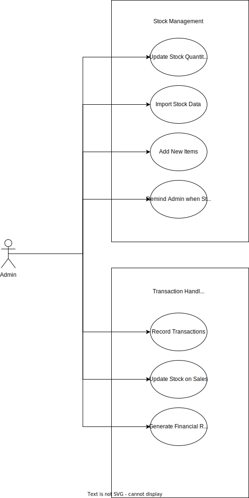

# BusiMan

## Introduction
We have developed an application to assist small businesses in their day to day operations. We have partnered with our sponsor **Insert Sponsor Here** to upgrade their current systems from excel spreadsheets and paper financial records to a digital system capable of handling finances and stock management.

## Problem Statement
Manual stock taking and financial records is very slow and prone to human error.

## Functional Requirements
1. The system must be able to manage a database of stock.
1. The system must be able to record transactions and update stock levels appropraitely.
1. The system must be able to notify the user if stock levels get low.
1. The system must be able to generate financial reports based on the transactions throughout the month.

## Non-functional Requirements
1. The system must use as little memory as required.
1. The system must be able to generate reports in a timely manner.
1. The purchasing system must have a friendly user-interface.

## Use Cases

## Feasibility and Risk Study